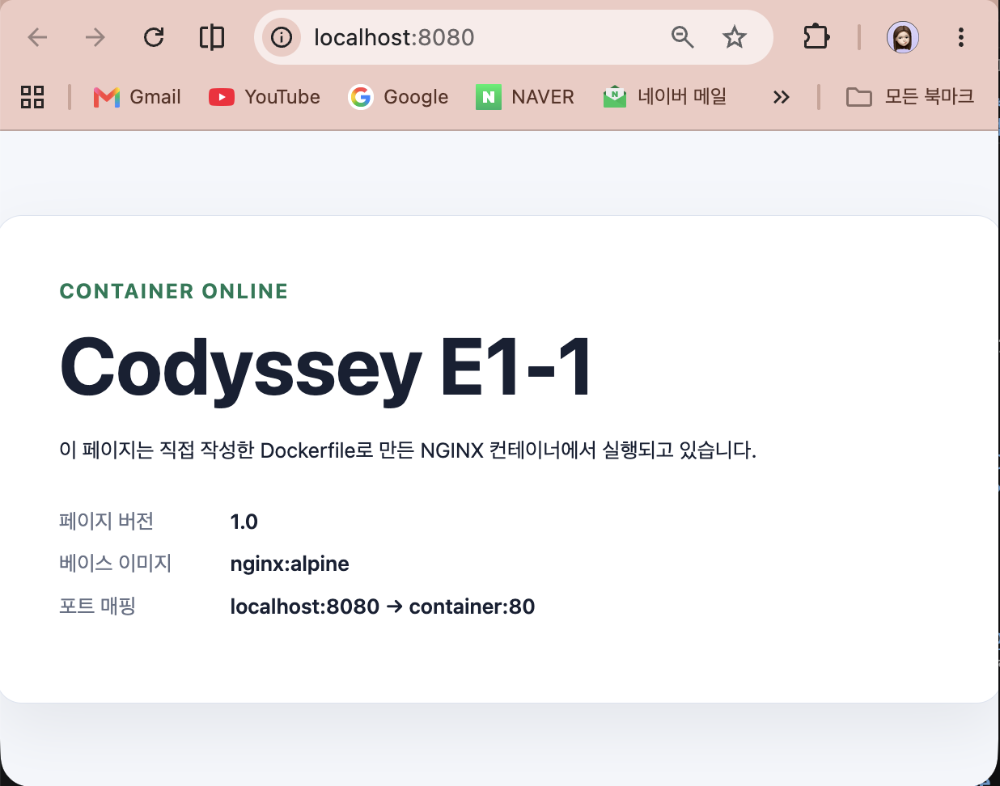
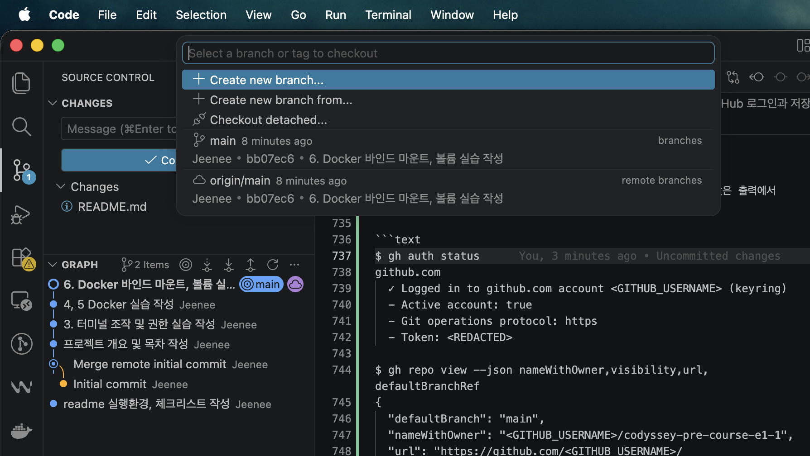

## 1. 프로젝트 개요 및 실행 환경

### 프로젝트 개요

이 저장소는 Codyssey Pre-course E1-1 과정에서 수행한 개발 워크스테이션 구축 및 기초 도구 실습 내용을 기록한 저장소이다.

터미널 명령어, 파일 및 디렉터리 권한, Docker 이미지와 컨테이너, Dockerfile, 포트 매핑, 바인드 마운트, Docker 볼륨, Git 및 GitHub 연동을 직접 실습한다.

실습에서 사용한 핵심 명령어와 실행 결과를 README에 기록하고,
필요한 경우 터미널 및 브라우저 화면을 캡처하여 실행 증거로 첨부한다.
이 문서만 읽어도 전체 수행 과정과 검증 방법을 파악할 수 있도록 작성하는 것을 목표로 한다.

### 실행 환경

- OS: macOS 26.5.2
- Architecture: Apple Silicon (`arm64`)
- Shell: `zsh`
- Terminal: iTerm2
- Docker: 27.4.0
- Git: 2.40.1

## 2. 수행 체크리스트

- [x] 터미널 기본 조작 및 폴더 구성
- [x] 권한 변경 실습
- [x] Docker 설치/점검
- [x] hello-world 실행
- [x] Dockerfile 빌드/실행
- [x] 포트 매핑 접속(2회)
- [x] 바인드 마운트 반영
- [x] 볼륨 영속성
- [x] Git 설정 + GitHub 원격 저장소 연동
- [x] VS Code GitHub 로그인 및 저장소 연동 화면 첨부

## 3. 터미널 조작 및 권한 실습

개인 사용자명과 홈 디렉터리 경로는 `<USER>`로 마스킹했다. 명령어 앞의 `$`는 터미널 프롬프트를 의미한다.

### 3.1 터미널 기본 조작

#### 1) 현재 위치 및 파일 목록 확인

`pwd`로 현재 위치를 확인하고, `ls`와 `ls -la`로 일반 목록과 숨김 항목을 확인했다.

```text
$ pwd
/Users/<USER>/codyssey/pre-course-e1-1

$ ls
README.md

$ ls -la
total 16
drwxr-xr-x   4 <USER>  staff   128 Aug  2 19:10 .
drwxr-xr-x   5 <USER>  staff   160 Jul 28 12:37 ..
drwxr-xr-x  14 <USER>  staff   448 Aug  2 19:11 .git
-rw-r--r--   1 <USER>  staff  5907 Aug  2 18:58 README.md
```

`ls`에는 일반 파일만 표시되었고, `ls -la`에는 현재 디렉터리(`.`), 상위 디렉터리(`..`), 숨김 디렉터리인 `.git`과 권한 정보가 함께 표시되었다.

#### 2) 디렉터리 이동 및 파일 생성

`mkdir -p`로 중간 경로를 포함한 실습 디렉터리를 생성하고 `cd`로 이동했다. `touch`로 빈 파일을 만든 뒤 목록에서 파일 크기가 0바이트인지 확인했다.

```text
$ mkdir -p practice/terminal

$ ls
README.md
practice

$ cd practice/terminal

$ pwd
/Users/<USER>/codyssey/pre-course-e1-1/practice/terminal

$ touch empty-file.txt

$ ls -la
total 0
drwxr-xr-x  3 <USER>  staff  96 Aug  2 19:11 .
drwxr-xr-x  3 <USER>  staff  96 Aug  2 19:11 ..
-rw-r--r--  1 <USER>  staff   0 Aug  2 19:11 empty-file.txt
```

`printf`의 출력 리다이렉션(`>`)으로 `note.txt`를 생성하고, `cat`으로 작성된 내용을 확인했다.

```text
$ printf 'Codyssey CLI practice\n' > note.txt

$ cat note.txt
Codyssey CLI practice

$ ls -la
total 8
drwxr-xr-x  4 <USER>  staff  128 Aug  2 19:11 .
drwxr-xr-x  3 <USER>  staff   96 Aug  2 19:11 ..
-rw-r--r--  1 <USER>  staff    0 Aug  2 19:11 empty-file.txt
-rw-r--r--  1 <USER>  staff   22 Aug  2 19:11 note.txt
```

#### 3) 파일 복사 및 이름 변경

`cp`로 `note.txt`를 복사한 뒤 목록에서 원본과 복사본이 모두 존재하는지 확인했다.

```text
$ cp note.txt note-copy.txt

$ ls -la
total 16
drwxr-xr-x  5 <USER>  staff  160 Aug  2 19:11 .
drwxr-xr-x  3 <USER>  staff   96 Aug  2 19:11 ..
-rw-r--r--  1 <USER>  staff    0 Aug  2 19:11 empty-file.txt
-rw-r--r--  1 <USER>  staff   22 Aug  2 19:11 note-copy.txt
-rw-r--r--  1 <USER>  staff   22 Aug  2 19:11 note.txt
```

`mv`로 복사본의 이름을 변경한 뒤 기존 이름이 사라지고 새 이름이 표시되는지 확인했다.

```text
$ mv note-copy.txt renamed-note.txt

$ ls -la
total 16
drwxr-xr-x  5 <USER>  staff  160 Aug  2 19:11 .
drwxr-xr-x  3 <USER>  staff   96 Aug  2 19:11 ..
-rw-r--r--  1 <USER>  staff    0 Aug  2 19:11 empty-file.txt
-rw-r--r--  1 <USER>  staff   22 Aug  2 19:11 note.txt
-rw-r--r--  1 <USER>  staff   22 Aug  2 19:11 renamed-note.txt
```

#### 4) 파일 및 디렉터리 삭제 확인

`rm`으로 이름을 변경했던 파일을 삭제하고, `ls -la`를 다시 실행하여 `renamed-note.txt`가 사라진 것을 확인했다.

```text
$ rm renamed-note.txt

$ ls -la
total 8
drwxr-xr-x  4 <USER>  staff  128 Aug  2 19:11 .
drwxr-xr-x  3 <USER>  staff   96 Aug  2 19:11 ..
-rw-r--r--  1 <USER>  staff    0 Aug  2 19:11 empty-file.txt
-rw-r--r--  1 <USER>  staff   22 Aug  2 19:11 note.txt
```

삭제 실습용 디렉터리와 파일을 만든 뒤, 파일을 먼저 삭제했다. `ls -la delete-me`로 디렉터리가 비어 있는지 확인하고 `rmdir`로 빈 디렉터리를 삭제했다.

```text
$ mkdir delete-me

$ touch delete-me/temp.txt

$ find delete-me -maxdepth 2 -print
delete-me
delete-me/temp.txt

$ rm delete-me/temp.txt

$ ls -la delete-me
total 0
drwxr-xr-x  2 <USER>  staff   64 Aug  2 19:11 .
drwxr-xr-x  5 <USER>  staff  160 Aug  2 19:11 ..

$ rmdir delete-me

$ ls -la
total 8
drwxr-xr-x  4 <USER>  staff  128 Aug  2 19:11 .
drwxr-xr-x  3 <USER>  staff   96 Aug  2 19:11 ..
-rw-r--r--  1 <USER>  staff    0 Aug  2 19:11 empty-file.txt
-rw-r--r--  1 <USER>  staff   22 Aug  2 19:11 note.txt
```

마지막으로 빈 파일을 삭제하고 `ls -la`를 다시 실행하여 최종적으로 `note.txt`만 남은 것을 확인했다.

```text
$ rm empty-file.txt

$ ls -la
total 8
drwxr-xr-x  3 <USER>  staff  96 Aug  2 19:11 .
drwxr-xr-x  3 <USER>  staff  96 Aug  2 19:11 ..
-rw-r--r--  1 <USER>  staff  22 Aug  2 19:11 note.txt

$ cd ../..

$ pwd
/Users/<USER>/codyssey/pre-course-e1-1

$ find practice -maxdepth 3 -print
practice
practice/terminal
practice/terminal/note.txt
```

#### 5) 절대 경로와 상대 경로

- 절대 경로는 파일 시스템의 루트(`/`)부터 파일 위치를 나타낸다. 예: `/Users/<USER>/codyssey/pre-course-e1-1/practice/terminal/note.txt`
- 상대 경로는 현재 작업 중인 디렉터리를 기준으로 파일 위치를 나타낸다. 저장소 루트 기준 예: `practice/terminal/note.txt`

### 3.2 파일 및 디렉터리 권한 변경

`ls -l`과 `ls -ld`로 변경 전·후 권한을 확인했다. 실습이 끝난 뒤 파일은 `644`, 디렉터리는 `755`로 복구했다.

#### 1) 파일 권한 변경: `600` → `644`

```text
$ ls -l practice/terminal/note.txt
-rw-r--r--  1 <USER>  staff  22 Aug  2 19:11 practice/terminal/note.txt

$ chmod 600 practice/terminal/note.txt

$ ls -l practice/terminal/note.txt
-rw-------  1 <USER>  staff  22 Aug  2 19:11 practice/terminal/note.txt

$ chmod 644 practice/terminal/note.txt

$ ls -l practice/terminal/note.txt
-rw-r--r--  1 <USER>  staff  22 Aug  2 19:11 practice/terminal/note.txt
```

#### 2) 디렉터리 권한 변경: `700` → `755`

```text
$ ls -ld practice/terminal
drwxr-xr-x  3 <USER>  staff  96 Aug  2 19:11 practice/terminal

$ chmod 700 practice/terminal

$ ls -ld practice/terminal
drwx------  3 <USER>  staff  96 Aug  2 19:11 practice/terminal

$ chmod 755 practice/terminal

$ ls -ld practice/terminal
drwxr-xr-x  3 <USER>  staff  96 Aug  2 19:11 practice/terminal
```

#### 3) 권한 의미

- `r`, `w`, `x`는 각각 읽기(4), 쓰기(2), 실행(1) 권한을 의미한다.
- 세 자리 숫자는 왼쪽부터 소유자, 그룹, 기타 사용자의 권한을 나타낸다.
- 파일 권한 `600`은 소유자에게만 읽기·쓰기 권한을 준다.
- 파일 권한 `644`는 소유자에게 읽기·쓰기, 그룹과 기타 사용자에게 읽기 권한을 준다.
- 디렉터리 권한 `700`은 소유자에게만 읽기·쓰기·진입 권한을 준다.
- 디렉터리 권한 `755`는 소유자에게 읽기·쓰기·진입 권한, 그룹과 기타 사용자에게 읽기·진입 권한을 준다.
- 파일의 `x`는 파일을 프로그램처럼 실행할 수 있는 권한이고, 디렉터리의 `x`는 해당 디렉터리에 진입하고 내부 항목에 접근할 수 있는 권한이다.

## 4. Docker 환경 점검과 컨테이너 운영

Docker Desktop 환경을 점검하고, 이미지 다운로드부터 컨테이너 실행·조회·로그·리소스 확인·중지·재시작까지 직접 수행했다. 출력이 긴 `docker info`, `docker ps -a`, 컨테이너 내부 목록은 검증에 필요한 핵심 부분만 기록했으며, 기존 개인 Docker 객체의 행은 제외하고 과제용 `e1-` 컨테이너 결과를 발췌했다.

### 4.1 Docker 설치 및 daemon 점검

`docker --version`으로 Docker CLI 버전을 확인하고, `docker version`과 `docker info`로 클라이언트가 Docker daemon에 정상적으로 연결되는지 확인했다.

```text
$ docker --version
Docker version 27.4.0, build bde2b89

$ docker version
Client:
 Version:    27.4.0
 OS/Arch:    darwin/arm64
 Context:    desktop-linux

Server: Docker Desktop 4.37.2
 Engine:
  Version:   27.4.0
  OS/Arch:   linux/arm64

$ docker info
Server Version: 27.4.0
Storage Driver: overlay2
Operating System: Docker Desktop
OSType: linux
Architecture: aarch64
CPUs: 10
Total Memory: 9.704GiB
```

클라이언트는 macOS의 `darwin/arm64`에서 실행되고, Docker Desktop의 Linux VM 안에서는 Docker 서버가 `linux/arm64`로 실행된다. `docker info`에서 서버 정보가 출력되었으므로 Docker daemon 연결도 정상이다.

### 4.2 `hello-world` 이미지와 컨테이너

#### 1) 이미지 다운로드 및 실행

```text
$ docker pull hello-world
Using default tag: latest
Status: Downloaded newer image for hello-world:latest
docker.io/library/hello-world:latest

$ docker run --name e1-hello hello-world

Hello from Docker!
This message shows that your installation appears to be working correctly.
```

`Hello from Docker!`가 출력되어 이미지 다운로드, 컨테이너 생성, 컨테이너 실행, 터미널 출력 전달 과정이 정상임을 확인했다.

#### 2) 이미지와 컨테이너 상태 확인

```text
$ docker images hello-world
REPOSITORY    TAG       IMAGE ID       CREATED        SIZE
hello-world   latest    eb84fdc6f2a3   4 months ago   5.2kB

$ docker ps
CONTAINER ID   IMAGE     COMMAND   CREATED   STATUS   PORTS   NAMES

$ docker ps -a
CONTAINER ID   IMAGE         COMMAND    STATUS       NAMES
92ac7c960581   hello-world   "/hello"   Exited (0)   e1-hello
```

`hello-world`는 메시지를 출력한 뒤 주 프로세스가 끝나는 컨테이너다. 따라서 실행 중인 컨테이너만 보여주는 `docker ps`에는 없지만, 종료된 컨테이너까지 보여주는 `docker ps -a`에서는 종료 코드 `0`으로 확인된다.

#### 3) 컨테이너 로그 확인

```text
$ docker logs e1-hello

Hello from Docker!
This message shows that your installation appears to be working correctly.
```

종료된 컨테이너도 삭제 전이라면 `docker logs`로 실행 당시의 표준 출력을 다시 확인할 수 있다.

### 4.3 실행 중인 컨테이너와 리소스 확인

계속 실행되는 NGINX 컨테이너를 백그라운드로 시작한 뒤 `docker ps`와 `docker stats --no-stream`으로 상태와 리소스 사용량을 확인했다.

```text
$ docker run -d --name e1-stats nginx:alpine
33b967ca2a9828dffb2959f7a5eeb0a35a2d6be05871e5240975d2bd15596642

$ docker ps
CONTAINER ID   IMAGE          STATUS                  PORTS    NAMES
33b967ca2a98   nginx:alpine   Up Less than a second   80/tcp   e1-stats

$ docker stats --no-stream e1-stats
CONTAINER ID   NAME       CPU %   MEM USAGE / LIMIT     MEM %   NET I/O
33b967ca2a98   e1-stats   0.00%   14.96MiB / 9.704GiB   0.15%   606B / 0B
```

컨테이너를 중지한 뒤 종료된 상태가 `docker ps -a`에 표시되는지 확인했다.

```text
$ docker stop e1-stats
e1-stats

$ docker ps -a
CONTAINER ID   IMAGE          STATUS       NAMES
33b967ca2a98   nginx:alpine   Exited (0)   e1-stats
```

### 4.4 Ubuntu 컨테이너와 생명주기

#### 1) Ubuntu 이미지 및 컨테이너 실행

```text
$ docker pull ubuntu:24.04
24.04: Pulling from library/ubuntu
Status: Downloaded newer image for ubuntu:24.04
docker.io/library/ubuntu:24.04

$ docker run -dit --name e1-ubuntu ubuntu:24.04 bash
f99c5fc546245d336d8a9e6fe97653ec8ef4a71eebdc49a819476e2311d1fb2b

$ docker images ubuntu:24.04
REPOSITORY   TAG       IMAGE ID       CREATED       SIZE
ubuntu       24.04     ea17ec341c42   5 weeks ago   101MB
```

이미지는 컨테이너를 만들기 위한 변경되지 않는 실행 템플릿이고, 컨테이너는 해당 이미지에서 생성되어 실행되는 인스턴스다.

#### 2) 컨테이너 내부 명령과 리소스 확인

```text
$ docker exec e1-ubuntu bash -lc 'pwd; ls -la; echo "hello from ubuntu"'
/
total 56
-rwxr-xr-x   1 root root    0 .dockerenv
lrwxrwxrwx   1 root root    7 bin -> usr/bin
drwxr-xr-x   1 root root 4096 etc
drwxr-xr-x   3 root root 4096 home
drwxr-xr-x  11 root root 4096 usr
drwxr-xr-x  11 root root 4096 var
hello from ubuntu

$ docker stats --no-stream e1-ubuntu
CONTAINER ID   NAME        CPU %   MEM USAGE / LIMIT    MEM %   PIDS
f99c5fc54624   e1-ubuntu   0.00%   1.07MiB / 9.704GiB   0.01%   1
```

컨테이너 내부의 현재 위치가 루트 디렉터리(`/`)이고, Ubuntu 파일 시스템과 `echo` 출력이 정상임을 확인했다.

#### 3) 중지 및 재시작

```text
$ docker stop e1-ubuntu
e1-ubuntu

$ docker ps -a
CONTAINER ID   IMAGE          COMMAND   STATUS        NAMES
f99c5fc54624   ubuntu:24.04   "bash"    Exited (137)  e1-ubuntu

$ docker start e1-ubuntu
e1-ubuntu

$ docker ps
CONTAINER ID   IMAGE          COMMAND   STATUS   NAMES
f99c5fc54624   ubuntu:24.04   "bash"    Up       e1-ubuntu
```

중지한 컨테이너는 `docker ps -a`에 남아 있으며, `docker start`로 같은 컨테이너를 다시 실행할 수 있다. 이 컨테이너의 주 프로세스인 `bash`가 종료 신호 후 종료되어 `137`이 표시되었지만, 컨테이너 자체는 정상적으로 다시 시작되었다.

### 4.5 `docker exec`와 `docker attach`

#### 1) 대화형 `exec`

```text
$ docker exec -it e1-ubuntu bash
root@<CONTAINER_ID>:/# echo "interactive shell"
interactive shell
root@<CONTAINER_ID>:/# pwd
/
root@<CONTAINER_ID>:/# ls
bin  boot  dev  etc  home  lib  media  mnt  opt  proc  root  run  sbin  srv  sys  tmp  usr  var
root@<CONTAINER_ID>:/# exit
exit

$ docker ps
CONTAINER ID   IMAGE          COMMAND   STATUS   NAMES
f99c5fc54624   ubuntu:24.04   "bash"    Up       e1-ubuntu
```

`docker exec`는 실행 중인 컨테이너 안에 새로운 프로세스를 만든다. 따라서 `exec`로 실행한 셸에서 `exit`해도 컨테이너의 주 프로세스는 종료되지 않아 컨테이너가 계속 실행된다.

#### 2) 주 프로세스에 `attach` 후 분리

```text
$ docker attach e1-ubuntu
root@<CONTAINER_ID>:/# echo "attached to main process"
attached to main process
root@<CONTAINER_ID>:/# Ctrl-p Ctrl-q
read escape sequence

$ docker ps
CONTAINER ID   IMAGE          COMMAND   STATUS   NAMES
f99c5fc54624   ubuntu:24.04   "bash"    Up       e1-ubuntu

$ docker exec e1-ubuntu echo "exec creates another process"
exec creates another process

$ docker ps
CONTAINER ID   IMAGE          COMMAND   STATUS   NAMES
f99c5fc54624   ubuntu:24.04   "bash"    Up       e1-ubuntu
```

`docker attach`는 컨테이너의 주 프로세스에 직접 연결한다. 여기서 `exit`하면 주 프로세스가 종료되어 컨테이너도 멈출 수 있으므로, `Ctrl-p` 다음 `Ctrl-q`를 눌러 컨테이너를 종료하지 않고 분리했다. 분리 후에도 컨테이너가 실행 중이고 `docker exec`로 별도 프로세스를 실행할 수 있음을 확인했다.

## 5. Dockerfile, 이미지 빌드 및 포트 매핑

`nginx:alpine`을 베이스 이미지로 선택하고, 직접 만든 정적 웹페이지를 포함한 커스텀 이미지를 제작했다. NGINX는 정적 파일을 제공하는 웹 서버가 기본 구성되어 있고 Alpine 기반 이미지는 비교적 가벼워 이번 실습에 적합하다.

### 5.1 웹페이지 소스코드

웹페이지 소스는 [`site/index.html`](site/index.html)에 작성했다. 미션 이름, Docker 컨테이너에서 실행 중이라는 설명, 페이지 버전과 포트 매핑 정보를 표시하도록 구성했다.

```html
<div class="status">CONTAINER ONLINE</div>
<h1>Codyssey E1-1</h1>
<p>이 페이지는 직접 작성한 Dockerfile로 만든 NGINX 컨테이너에서 실행되고 있습니다.</p>
<dl>
  <dt>페이지 버전</dt>
  <dd>1.0</dd>
  <dt>베이스 이미지</dt>
  <dd>nginx:alpine</dd>
  <dt>포트 매핑</dt>
  <dd>localhost:8080 → container:80</dd>
</dl>
```

### 5.2 Dockerfile

```dockerfile
FROM nginx:alpine

COPY site/ /usr/share/nginx/html/

EXPOSE 80
```

| 커스텀 포인트 | 실제 적용 내용 | 적용 목적 |
|---|---|---|
| 베이스 이미지 | `FROM nginx:alpine` | 기존 NGINX 웹 서버를 이용해 정적 페이지를 실행한다. |
| 정적 콘텐츠 | `COPY site/ /usr/share/nginx/html/` | 기본 NGINX 페이지를 직접 만든 Codyssey 페이지로 교체한다. |
| 컨테이너 포트 | `EXPOSE 80` | NGINX가 사용하는 컨테이너 내부 포트가 80임을 문서화한다. |

`EXPOSE 80`은 이미지가 사용하는 포트를 알려주는 설정이며, 호스트에서 실제로 접속할 수 있게 만드는 포트 매핑은 컨테이너 실행 시 `-p` 옵션으로 지정한다.

### 5.3 커스텀 이미지 빌드

```text
$ docker build -t codyssey-e1-web:1.0 .
#1 [internal] load build definition from Dockerfile
#2 [internal] load metadata for docker.io/library/nginx:alpine
#5 [1/2] FROM docker.io/library/nginx:alpine
#6 [2/2] COPY site/ /usr/share/nginx/html/
#7 exporting to image
#7 naming to docker.io/library/codyssey-e1-web:1.0 done
#7 DONE 0.0s

$ docker images codyssey-e1-web
REPOSITORY        TAG   IMAGE ID       CREATED                  SIZE
codyssey-e1-web   1.0   8251443efc2c   Less than a second ago   61.8MB
```

Dockerfile의 `FROM`과 `COPY` 단계가 완료되었고, `codyssey-e1-web:1.0` 이미지가 생성된 것을 확인했다.

### 5.4 컨테이너 실행 및 포트 매핑

호스트의 8080 포트를 컨테이너의 80 포트에 연결해 웹 서버 컨테이너를 실행했다.

```text
$ docker run -d --name e1-web -p 8080:80 codyssey-e1-web:1.0
a039982cb9ebe5e4d660047e5c4df08ff75aa0a8cee2293a7301032b7f2a73a0

$ docker ps
CONTAINER ID   IMAGE                 STATUS                  PORTS                  NAMES
a039982cb9eb   codyssey-e1-web:1.0   Up Less than a second   0.0.0.0:8080->80/tcp   e1-web
```

`-p 8080:80`은 호스트의 `localhost:8080`으로 들어온 요청을 컨테이너 내부 NGINX의 80 포트로 전달한다. 컨테이너 네트워크는 호스트와 분리되어 있으므로 외부에서 접속하려면 이 포트 연결이 필요하다.

### 5.5 HTTP 응답 및 접근 로그 검증

```text
$ curl -i http://localhost:8080
HTTP/1.1 200 OK
Server: nginx/1.31.3
Content-Type: text/html
Content-Length: 1539

<!doctype html>
<html lang="ko">
...
<h1>Codyssey E1-1</h1>
<p>이 페이지는 직접 작성한 Dockerfile로 만든 NGINX 컨테이너에서 실행되고 있습니다.</p>
...
</html>

$ docker logs e1-web
2026/08/02 12:03:09 [notice] 1#1: nginx/1.31.3
2026/08/02 12:03:09 [notice] 1#1: start worker processes
172.17.0.1 - - [02/Aug/2026:12:03:09 +0000] "GET / HTTP/1.1" 200 1539 "-" "curl/8.7.1" "-"
```

`curl`에서 HTTP 상태 코드 `200 OK`와 직접 작성한 HTML이 반환되었다. `docker logs e1-web`에서도 `GET / HTTP/1.1` 요청이 상태 코드 `200`으로 처리된 것을 확인했다.

### 5.6 브라우저 접속 증거

브라우저 주소창의 `localhost:8080`과 직접 만든 웹페이지가 함께 표시되는 것을 확인했다.



## 6. 바인드 마운트와 볼륨 영속성

바인드 마운트로 호스트 파일의 변경이 이미지 재빌드 없이 컨테이너에 반영되는지 확인하고, Docker 볼륨으로 컨테이너를 삭제한 뒤에도 데이터가 유지되는지 검증했다.

### 6.1 바인드 마운트 변경 반영

호스트의 `site` 디렉터리를 NGINX의 정적 파일 경로인 `/usr/share/nginx/html`에 연결하고, 호스트의 8081 포트를 컨테이너의 80 포트에 매핑했다.

```text
$ docker run -d --name e1-bind -p 8081:80 --mount type=bind,source="$(pwd)/site",target=/usr/share/nginx/html nginx:alpine
86111adfa4d9ca7b1a1f6a3c4d92cceef200994ef313d7960f66bb5667b3915e

$ docker ps
CONTAINER ID   IMAGE                 STATUS   PORTS                  NAMES
86111adfa4d9   nginx:alpine          Up       0.0.0.0:8081->80/tcp   e1-bind
a039982cb9eb   codyssey-e1-web:1.0   Up       0.0.0.0:8080->80/tcp   e1-web

$ curl -s http://localhost:8081
<!doctype html>
<html lang="ko">
...
<div class="status">CONTAINER ONLINE</div>
...
<dd>1.0</dd>
...
<dd>localhost:8080 → container:80</dd>
...
</html>
```

컨테이너가 실행 중인 상태에서 호스트의 `site/index.html`을 터미널 명령으로 수정했다. macOS의 `sed`는 제자리 수정을 위해 `-i ''`를 사용하며, Linux에서는 `-i`만 사용하면 된다.

```text
$ sed -i '' \
  -e 's/CONTAINER ONLINE/BIND MOUNT UPDATED/' \
  -e 's/이 페이지는 직접 작성한 Dockerfile로 만든 NGINX 컨테이너에서 실행되고 있습니다\./호스트의 파일 변경이 바인드 마운트를 통해 NGINX 컨테이너에 바로 반영되었습니다./' \
  -e 's/<dd>1.0<\/dd>/<dd>1.1<\/dd>/' \
  -e 's/localhost:8080/localhost:8081/' \
  site/index.html

$ grep -nE 'BIND MOUNT UPDATED|<dd>1.1|localhost:8081' site/index.html
61:    <div class="status">BIND MOUNT UPDATED</div>
66:      <dd>1.1</dd>
70:      <dd>localhost:8081 → container:80</dd>

$ curl -s http://localhost:8081 | grep -E 'BIND MOUNT UPDATED|<dd>1.1|localhost:8081'
    <div class="status">BIND MOUNT UPDATED</div>
      <dd>1.1</dd>
      <dd>localhost:8081 → container:80</dd>
```

두 번의 HTTP 확인 사이에 `docker build`나 컨테이너 재시작을 수행하지 않았다. 따라서 버전이 `1.0`에서 `1.1`로 바뀐 결과는 호스트 파일 변경이 바인드 마운트를 통해 실행 중인 컨테이너에 즉시 반영된 증거다.

### 6.2 Docker 볼륨 영속성

Docker 볼륨을 생성한 뒤 첫 번째 컨테이너에서 파일을 저장하고, 해당 컨테이너를 삭제했다.

```text
$ docker volume create e1-data
e1-data

$ docker volume ls
DRIVER   VOLUME NAME
local    e1-data

$ docker run --name e1-volume-1 --mount source=e1-data,target=/data alpine sh -c 'echo "persistent-data-e1" > /data/result.txt && cat /data/result.txt'
persistent-data-e1

$ docker ps -a
CONTAINER ID   IMAGE    STATUS                     NAMES
4094aace4aa0   alpine   Exited (0)                 e1-volume-1

$ docker rm e1-volume-1
e1-volume-1

$ docker volume ls
DRIVER   VOLUME NAME
local    e1-data
```

첫 번째 컨테이너를 삭제한 뒤에도 `e1-data` 볼륨이 남아 있음을 확인했다. 이어서 같은 볼륨을 두 번째 컨테이너에 연결해 기존 파일을 읽었다.

```text
$ docker run --name e1-volume-2 --mount source=e1-data,target=/data alpine cat /data/result.txt
persistent-data-e1

$ docker ps -a
CONTAINER ID   IMAGE    STATUS       NAMES
e6d4722bf7f4   alpine   Exited (0)   e1-volume-2
```

첫 번째 컨테이너에서 기록한 `persistent-data-e1`이 두 번째 컨테이너에서도 동일하게 출력되었다. 컨테이너를 삭제해도 Docker 볼륨의 데이터는 독립적으로 유지되며, 다른 컨테이너에 다시 연결해 사용할 수 있음을 확인했다. 위 `docker volume ls`와 `docker ps -a` 출력에서는 과제와 관계없는 기존 Docker 객체의 행을 제외했다.

### 6.3 바인드 마운트와 볼륨 비교

| 구분 | 바인드 마운트 | Docker 볼륨 |
|---|---|---|
| 저장 위치 관리 | 호스트의 지정 경로를 직접 사용 | Docker가 저장 위치를 관리 |
| 이번 검증 | 호스트 파일 변경이 실행 중인 웹페이지에 즉시 반영됨 | 컨테이너 삭제 후 새 컨테이너에서도 데이터가 유지됨 |
| 주요 용도 | 개발 중 소스코드와 설정 파일 공유 | 컨테이너와 독립적으로 유지할 애플리케이션 데이터 저장 |

## 7. Git, GitHub 및 VS Code 연동

Git 사용자 정보와 기본 브랜치를 설정하고, 로컬 저장소의 `main` 브랜치가 GitHub 원격 저장소의 `origin/main`을 추적하도록 연결했다. 공개 문서에는 실제 이름과 이메일, GitHub 사용자명을 각각 `<GITHUB_DISPLAY_NAME>`, `<GITHUB_NOREPLY_EMAIL>`, `<GITHUB_USERNAME>`으로 마스킹했다.

### 7.1 Git 사용자 정보와 기본 브랜치 설정

사용자명과 이메일은 기존에 설정되어 있던 GitHub 표시명과 noreply 이메일을 사용했다. 기본 브랜치 설정은 비어 있어 `main`으로 설정했다. 전체 설정을 확인한 뒤 README에는 인증정보가 없는 안전한 항목만 발췌했다.

```text
$ git --version
git version 2.40.1

$ git config --global user.name
<GITHUB_DISPLAY_NAME>

$ git config --global user.email
<GITHUB_NOREPLY_EMAIL>

$ git config --global init.defaultBranch main

$ git config --list
user.name=<GITHUB_DISPLAY_NAME>
user.email=<GITHUB_NOREPLY_EMAIL>
init.defaultbranch=main
core.repositoryformatversion=0
core.bare=false
remote.origin.url=https://github.com/<GITHUB_USERNAME>/codyssey-pre-course-e1-1.git
remote.origin.fetch=+refs/heads/*:refs/remotes/origin/*
```

`user.name`과 `user.email`은 앞으로 만드는 커밋의 작성자 정보로 사용된다. `init.defaultBranch=main`은 새 Git 저장소를 만들 때 사용할 기본 브랜치 이름을 `main`으로 지정한다.

### 7.2 GitHub 원격 저장소 연결

현재 브랜치와 원격 저장소 주소를 확인한 뒤, `main` 브랜치가 `origin/main`을 추적하도록 설정했다. 아래 원격 주소는 개인정보 보호를 위해 GitHub 사용자명만 마스킹했다.

```text
$ git branch --show-current
main

$ git remote -v
origin  https://github.com/<GITHUB_USERNAME>/codyssey-pre-course-e1-1.git (fetch)
origin  https://github.com/<GITHUB_USERNAME>/codyssey-pre-course-e1-1.git (push)

$ git fetch origin main
From https://github.com/<GITHUB_USERNAME>/codyssey-pre-course-e1-1
 * branch            main       -> FETCH_HEAD

$ git branch --set-upstream-to=origin/main main
branch 'main' set up to track 'origin/main'.

$ git status --short --branch
## main...origin/main

$ git rev-list --left-right --count main...origin/main
0       0
```

확인 당시 로컬 `main`과 원격 `origin/main`의 앞선 커밋과 뒤처진 커밋 수가 모두 `0`이어서 두 브랜치가 같은 커밋을 가리키고 있었다. 이번 README 작성 내용은 로컬에서만 수정했으며 별도의 커밋이나 `git push`는 수행하지 않았다.

### 7.3 GitHub 로그인과 저장소 공개 상태

GitHub CLI의 인증 상태와 현재 저장소 정보를 확인했다. 실제 토큰 값은 출력에서 제거했으며 README에 기록하지 않았다.

```text
$ gh auth status
github.com
  ✓ Logged in to github.com account <GITHUB_USERNAME> (keyring)
  - Active account: true
  - Git operations protocol: https
  - Token: <REDACTED>

$ gh repo view --json nameWithOwner,visibility,url,defaultBranchRef
{
  "defaultBranch": "main",
  "nameWithOwner": "<GITHUB_USERNAME>/codyssey-pre-course-e1-1",
  "url": "https://github.com/<GITHUB_USERNAME>/codyssey-pre-course-e1-1",
  "visibility": "PUBLIC"
}
```

`Active account: true`와 HTTPS 프로토콜 설정으로 GitHub 인증 상태를 확인했다. 저장소 공개 범위는 `PUBLIC`, 기본 브랜치는 `main`이다.

### 7.4 VS Code GitHub 연동

VS Code에서 이 저장소 폴더를 열고 GitHub 계정 로그인, `main` 브랜치, Source Control의 저장소 연결 상태가 한 화면에 보이도록 확인한다. 토큰, 이메일, 인증 코드 등 민감정보가 보이지 않는 화면만 `screenshots/12-vscode-github.png`로 첨부한다.

캡처에서 Source Control에 현재 수정 파일이 표시되고, 브랜치 목록에 로컬 `main`과 원격 `origin/main`이 함께 표시되는 것을 확인했다.



### 7.5 Git과 GitHub의 차이

| 구분 | Git | GitHub |
|---|---|---|
| 역할 | 로컬 컴퓨터에서 파일 변경 이력과 브랜치를 관리하는 버전 관리 도구 | Git 저장소를 원격에 보관하고 공유·협업할 수 있는 플랫폼 |
| 이번 실습 | `main` 브랜치와 커밋 이력을 로컬에서 관리 | 원격 저장소 `origin` 연결, 공개 범위와 동기화 상태 확인 |

## 8. 트러블슈팅 및 최종 검증
